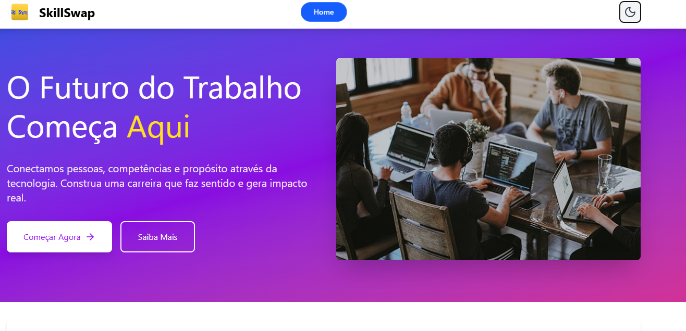
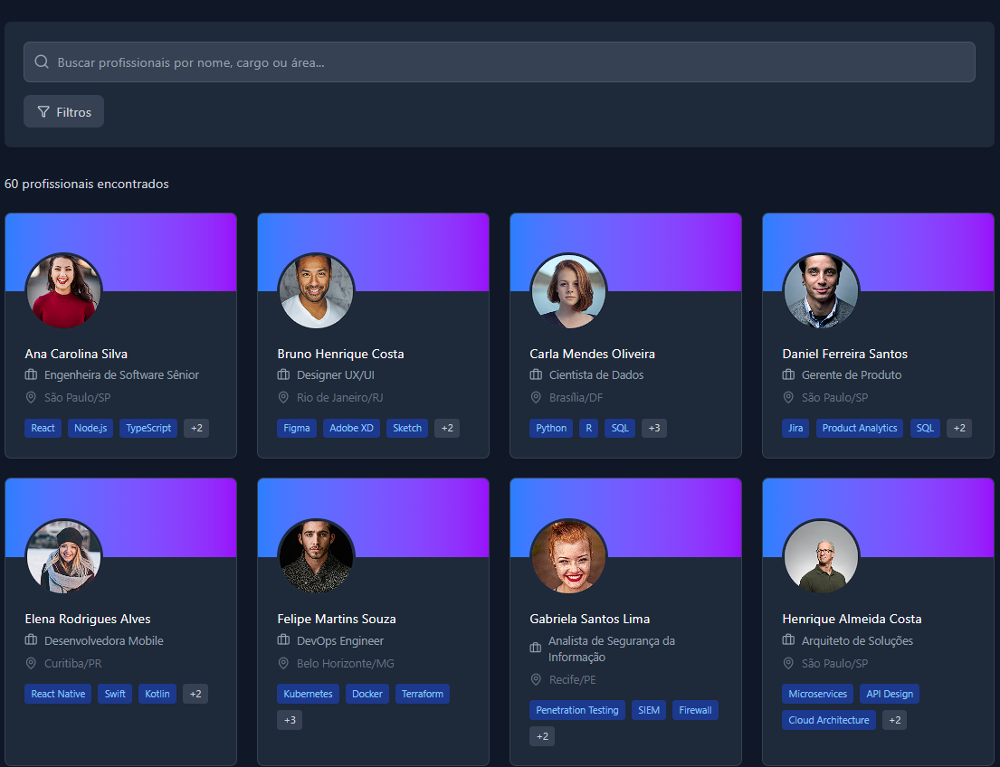
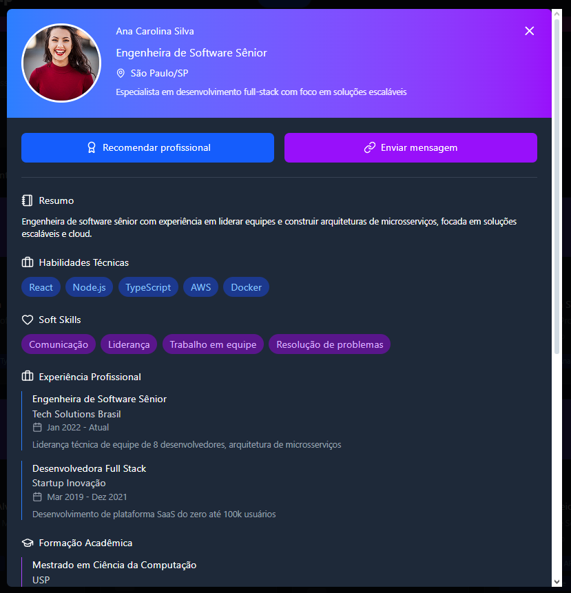

## ✨ **SkillSwap: Conectando Talentos e Impulsionando o Aprendizado** ✨

---

## 💡 **Visão Geral do Projeto**

**Web-SkillSwap-JS** é uma vibrante plataforma web concebida para **facilitar a troca de habilidades e conhecimentos** entre pessoas. Pense nela como um ponto de encontro digital onde a colaboração é a moeda principal. Nosso objetivo é **democratizar o aprendizado e o compartilhamento de talentos**, permitindo que você encontre a pessoa perfeita para uma colaboração, um projeto mútuo, ou simplesmente para aprender algo novo ensinando o que você já domina.

---

## 🚀 **Tecnologias Utilizadas**

O projeto foi construído utilizando um *stack* moderno e performático, garantindo escalabilidade, velocidade de desenvolvimento e uma ótima experiência de usuário.

| Categoria | Tecnologia | Descrição |
| :--- | :--- | :--- |
| **Framework** | **React** | Biblioteca JavaScript líder para construção de interfaces de usuário dinâmicas. |
| **Build Tool** | **Vite** | Ferramenta de build de nova geração que oferece um desenvolvimento extremamente rápido ⚡️. |
| **Estilização** | **Tailwind CSS** | Framework de CSS *utility-first* para um design moderno, responsivo e flexível. |
| **Roteamento** | **React Router** | Solução padrão para navegação fluida e roteamento de componentes na aplicação. |
| **Animações** | **Sooner** | Biblioteca para a adição de efeitos visuais e animações suaves na interface. |
| **Linguagem** | **JavaScript (ES6+)** | A linguagem base de toda a aplicação web. |

---

## 🖼️ **Galeria do Projeto**

Algumas das capturas de tela da aplicação em funcionamento:







---

## 🧭 **Principais Funcionalidades e Detalhes**

A plataforma foi pensada para ser intuitiva, focada na conexão e rica em recursos de UX:

* **Exploração de Perfis Profissionais:** A aplicação é focada em exibir e explorar perfis profissionais já cadastrados. **Não é possível criar novos perfis** — os dados são estáticos, carregados de um arquivo JSON local.
* **Busca com Filtragem Inteligente:** Encontre outros talentos através de **filtros e buscas avançadas** por habilidades ou interesses, facilitando a descoberta de potenciais parceiros de troca.
* **Dark Mode (Tema Escuro):** Implementação de um tema escuro para melhor conforto visual. A preferência do usuário é **salva no `localStorage`** para manter o tema escolhido em futuras visitas.
* **Efeitos Visuais Aprimorados:** Utilização da biblioteca **Sooner** para adicionar **animações e efeitos visuais** atraentes, elevando a experiência do usuário.
* **Interface Amigável:** Design limpo e moderno (Tailwind CSS), garantindo facilidade de uso em qualquer dispositivo.

---

## 🛠️ **Configuração Local do Projeto**

Quer explorar o código? É simples e rápido!

### **Pré-requisitos**

Certifique-se de ter o **Node.js** e o **npm** (ou Yarn/pnpm) instalados na sua máquina.

### **Instalação e Execução**

Siga estes passos para colocar o **SkillSwap** rodando localmente:

1.  **Clone o Repositório:**
    ```bash
    git clone [https://github.com/GS-SkillSwap/Web-SkillSwap-JS.git](https://github.com/GS-SkillSwap/Web-SkillSwap-JS.git)
    cd Web-SkillSwap-JS
    ```

2.  **Instale as Dependências:**
    ```bash
    npm install
    ```

3.  **Execute o Servidor de Desenvolvimento:**
    ```bash
    npm run dev
    ```

4.  **Acesse a Aplicação:**
    Abra o seu navegador favorito e acesse **`http://localhost:5173`** (ou a URL que for exibida no seu terminal).

---

## 👤 **Usuários de Teste e Dados Mockados**

Para que você possa interagir com a aplicação imediatamente, utilizamos um sistema de dados simulados:

* **Autenticação:** Não é necessário fazer login. O projeto simula a experiência de navegação e interação.
* **Dados:** Os perfis de usuários, habilidades e interesses são carregados a partir do arquivo **`data/profiles.json`** (o arquivo estático local). Sinta-se à vontade para editar este arquivo e testar diferentes cenários de perfis!

---

## 🔗 **Links Úteis**

| Recurso | Link |
| :--- | :--- |
| **Aplicação Publicada (Deploy)** | [https://skillswap-js.vercel.app](https://skillswap-js.vercel.app) |
| **Repositório do Código Fonte** | [https://github.com/GS-SkillSwap/Web-SkillSwap-JS](https://github.com/GS-SkillSwap/Web-SkillSwap-JS) |

---

## 🤝 **Integrantes do Grupo**

Este projeto foi desenvolvido com dedicação e empenho por:

* **Eduardo Ulisses** - RM 566339
* **Fernando Bellegarde** - RM 564169
* **Otávio Inaba** - RM 565003

---